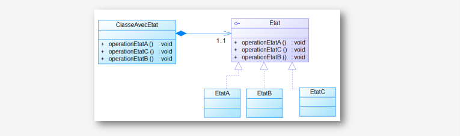

## State Pattern
### Description
The state pattern serves as a behavioral design pattern in software development, enabling an object to modify its behavior based on changes in its internal state. It closely aligns with the principles of finite-state machines. Another perspective is to view the state pattern as akin to the strategy pattern, where the object can dynamically switch between different strategies by invoking methods defined in the pattern's interface.
### Class Diagram


### Application

### Implementation
In this example, we have an airplane that can be in three states: in the garage, on the runway, and in the air. The airplane can perform four actions: take off, land, enter the garage, and leave the garage. The actions that the airplane can perform depend on its state. For example, if the airplane is in the garage, it cannot take off or land. The state pattern allows us to change the behavior of the airplane depending on its state.
* Avion interface
```java
public interface Avion {
    void sortirDuGarrage(); 

    void entrerAuGarrage(); 

    void decoller(); 

    void atterir(); 

    void doActivity(); 
}
```
* State class

This class is abstract and contains the methods that the airplane can perform. Each method is abstract and will be implemented in the subclasses.
```java
abstract class State {
        protected AvionImpl avion;

        public State(AvionImpl avion) {
            this.avion = avion;
        }

        public abstract void sortirDuGarrage();

        public abstract void entrerAuGarrage();

        public abstract void decoller();

        public abstract void atterir();

        public abstract void doActivity();
    }
```
* EnPisteState class
```java
class EnPisteState extends State {
        public EnPisteState(AvionImpl avion) {
            super(avion);
        }

        @Override
        public void sortirDuGarrage() {
            System.out.println("Impossible de sortir du garage depuis la piste");
        }

        @Override
        public void entrerAuGarrage() {
            System.out.println("transition: en pist -> au garage");
            avion.state = new AuGarageState(avion);
        }

        @Override
        public void decoller() {
            System.out.println("transition: en pist -> décoller");
            avion.state = new EnAirState(avion);
        }

        @Override
        public void atterir() {
            System.out.println("impossible d'atterir depuis la piste");
        }

        @Override
        public void doActivity() {
            for (int i = 0; i < 10; i++) {
                System.out.println("activité: en piste...");
            }
        }
    }
```
* AuGarageState class
```java
class AuGarageState extends State {

        public AuGarageState(AvionImpl avion) {
            super(avion);
        }

        @Override
        public void sortirDuGarrage() {
            System.out.printf("Transition: au garage -> en piste");
            avion.state = new EnPisteState(avion);
        }

        @Override
        public void entrerAuGarrage() {
            System.out.println("je suis déjà au garage");
        }

        @Override
        public void decoller() {
            System.out.println("impossible de décoller depuis le garage");
        }

        @Override
        public void atterir() {
            System.out.println("impossible d'atterir depuis le garage");
        }

        @Override
        public void doActivity() {
            for (int i = 0; i < 10; i++) {
                System.out.println("activité: au garage...");
            }
        }
    }
```
* EnAirState class
```java
 class EnAirState extends State {
        public EnAirState(AvionImpl avion) {
            super(avion);
        }

        @Override
        public void sortirDuGarrage() {
            System.out.println("impossible de sortir du garage depuis l'air");
        }

        @Override
        public void entrerAuGarrage() {
            System.out.println("impossible d'entrer au garage depuis l'air");
        }

        @Override
        public void decoller() {
            System.out.println("impossible de décoller je suis déjà en l'air");
        }

        @Override
        public void atterir() {
            System.out.println("transition: en air -> piste");
            avion.state = new EnPisteState(avion);
        }

        @Override
        public void doActivity() {
            for (int i = 0; i < 10; i++) {
                System.out.println("activité: en air...");
            }
        }
    }
```

### Conclusion
The state pattern is a behavioral software design pattern that allows an object to alter its behavior when its internal state changes. This pattern is close to the concept of finite-state machines. The state pattern can be interpreted as a strategy pattern, which is able to switch a strategy through invocations of methods defined in the pattern's interface.


